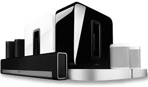

<table style="border: none;">
  <tr>
    <td style="border: none;"></td>
    <td style="border: none;">
      <h1 style="margin: 0;color: brown;">Sonos</h1>
      <h3 style="margin: 0;">Control Your Music with Your Voice</h3>
    </td>
  </tr>
</table>

SonosPlayer gives you the power to control your Sonos system and all your Sonos music with your voice.

    
    
SonosPlayer supports all Sonos players, soundbars, and Sonos Roam as well as your 5.1 system (soundbar, Sub, and 2 players)

It also allows you to redirect A.V.A.T.A.R's voice messages and all sounds played by the plugins to the Sonos clients.

This plugin is an add-on for the [A.V.A.T.A.R](https://avatar-home-automation.github.io/docs) framework. 

## Multi-room

The `sonosPlayer` plugin is fully multi-room; it automatically links A.V.A.T.A.R clients with the Sonos rooms.

## Multi-language

The `sonosPlayer` plugin relies solely on the system's available languages.

## Supported Platforms

| System | Supported | Comment |
|:-------|:---------:|:--------|
| Windows |  | The most interesting platform for system voices and execution speed |
| linux   |  | The most interesting platform for execution speed. Voices are generated by `espeak` and `mbrola`|
| macOS |  | System voices are available |

## Ready to get started? 
Install the plugin from the A.V.A.T.A.R Plugin library and follow the installation guide to integrate Sonos and unlock endless possibilities!