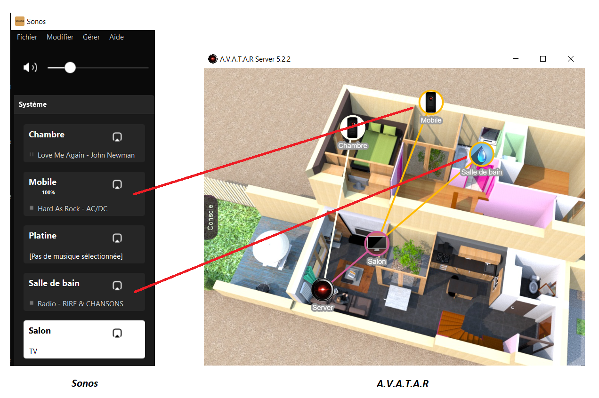
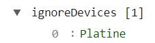
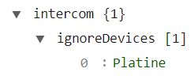

# Sonos Player

The connection between Sonos and A.V.A.T.A.R is automatic.  
The only thing to keep in mind is that the Sonos rooms in your system must have the same names as the A.V.A.T.A.R clients.

`sonosPlayer` plugin will then automatically link the A.V.A.T.A.R clients with the Sonos rooms.

**For example:**  
For a Sonos room named "Salon", you must have an A.V.A.T.A.R client named "Salon".

{width="600"}

**Don't have an A.V.A.T.A.R client to associate with the Sonos Player?**  
No worries, simply create a [virtual client](https://avatar-home-automation.github.io/docs/virtual-client/) with the name of the Sonos Player.

{width="600"}

## Exception

Some Players cannot be associated with an A.V.A.T.A.R client.  
For example, the [Sonos Port](https://www.sonos.com/fr-fr/shop/port)

To exclude a Player from the automatic recognition:

1. Start the A.V.A.T.A.R server (if it is not already running)
2. Open `Plugin Studio` and click on the `sonosPlayer` plugin
3. Click on the `Properties` tab
4. Add the name of a Player to exclude in the table of the `ignoreDevices` property

    For example, `Platine` is a `Sonos Port` that should be excluded:

    {width="170"}

4. Add this Player name to exclude in the table of the `intercom.ignoreDevices` property so that this Player is not taken into account in the `intercom` command.

    {width="170"}

5. Save the settings
6. Restart the server

???+ warning "Important"
    A.V.A.T.A.R clients must be connected for the association to be recognized by A.V.A.T.A.R.  
    If a client is not connected, you will receive an error message notifying you that A.V.A.T.A.R cannot find the associated client when you try to play music on that client.

