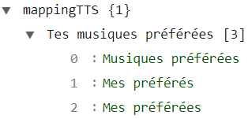
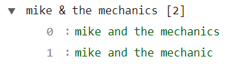
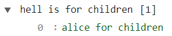
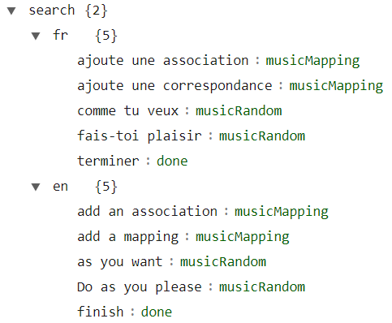

# Parameters

1. Start the A.V.A.T.A.R server (if it is not already running)
2. Open `Plugin Studio` and click on the `sonosPlayer` plugin
3. Click on the `Properties` tab
4. Set the properties
5. Save the settings
6. Restart the server

|
Parameter
| Type | Comment |
|:-----|:---:| :---|
|`ttsLanguage`| string | See [Configure a voice](voices.md#configure-a-voice) |
|`mappingOnServer`| array | Add in this table the clients for which the [Add an association rule](user-guide.md#add-an-association-rule) window will be displayed on the server instead of on the client. |
|`showSystemVoices`| boolean  | See [Retrieve available voices](voices.md#retrieve-available-voices) |
|`volumeUpDown`| integer | Used by the `volumeUp` and `volumeDown` commands. The volume increases or decreases by the value set in this parameter.|
|`devTools`| boolean | Allows the Chrome devTools console to be displayed (Reserved for development) |
|`Spotify.region`| object | Not used at the moment.| 
|`ignoreDevices`| array | See [the exceptions](Players-Sonos.md#exception) | 
|`playerTV`| string | Used by the `activateTvSound` command. By default, the plugin sets the sound to the TV using the `Playbar` device, which is normally defined as the main device in a 5:1 system. If you do not have a 5:1 system, define in this property the device that should be used to output sound to the TV. | 
|`intercom.ignoreDevices`| string | This property indicates to the `intercom` command which devices to ignore. Also see [the exceptions](Players-Sonos.md#exception) for more information.| 
|`platform`| object | See [shared directories](shared-folder.md) and [voices](voices.md) for information on all associated parameters. |
|`musicTypes.search`| array | Used by the `musicSearch` command. Defines **in order** all the search categories for music in your music library. You can modify the order and/or remove some. Possible categories:  `composers`, `playlists`, `albums`, `albumArtists`, `artists`, `genres`, `tracks`.  **Note:** The `sonos_playlists` category does not appear in this list but is the first one processed by the command.  **[ ] (empty):** Only the `sonos_playlists` category is processed.|
|`musicTypes.random`| array | Used by the `musicRandom` command when you perform a search via `musicSearch` and, when asked '_What would you like to listen to?_', you reply '_as you wish_'. Defines all the categories that can be used for a random music search.|
|`mappingTTS`| object | You can add in this property all the plugin's predefined responses to music titles.  **For example:** Suppose you search for a music title `mes préférés` (a playlist). Normally, the plugin repeats the title to confirm the command. You can change what is said here. If you want the plugin to confirm the search by saying `Tes musiques préférés` instead of `mes préférés` (which is the actual title), add an array as shown below: {width="240"}. You can include several possible interpretations of the title by the plugin.|
|`mappingRules`| object | In some cases, due to the title name as written in Sonos or your pronunciation, the search becomes very difficult for the plugin. By default, the plugin includes a search using [Levenshtein distance](https://en.wikipedia.org/wiki/Levenshtein_distance) (only in French and English) but it may not be sufficient. Add in this property all the predefined mappings for searching a music title.  **For example:** Suppose you search for an artist `mike and the mechanics` and in Sonos, the artist is named `mike & the mechanics`. Then add an array that groups all the comprehension variants as shown below: {width="240"}.  **Another example:** Suppose you search for a title `hell is for children`; if your English is as poor as the best, the plugin will understand anything, so add an array that groups all the comprehension variants as shown below: {width="200"}.  **Note:** The plugin offers you valuable assistance to automatically add a mapping array in this property (see [Add a association](user-guide.md#add-an-association-rule) for more details).|
|`search.<language>`| object | Defines the fixed rules possible for the [Music Search](user-guide.md#other-rules-in-the-search) command.  {width="300"}  **Important:** You must absolutely add a section in the language used.|
