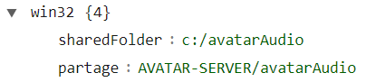
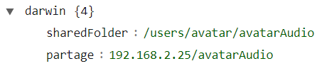
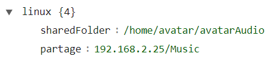
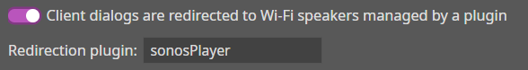

# Shared Folder

The shared folder is **mandatory** in order to redirect A.V.A.T.A.R dialogues and the plugin's music files to the Sonos players.

## Create a Shared Folder

1. Create a directory that will be shared on the platform where the server is located. For example:

    **Windows:** _C:/avatarAudio_  
    **linux/macOS:** _$HOME/avatarAudio_ 

2. Open `Sonos Controller` then go to `Manage` and click on `Music Library Settings` 
3. Depending on your platform, add a music folder:

    === "Windows"

        1. Click on `Another folder or a drive connected to my computer`
        2. Select the shared directory created in step 1

    === "macOS"

        1. Click on `Network device (e.g. NAS drive)`
        2. Enter the full directory created in step 1

            For example: if $HOME is _/users/avatar_ then the full directory is: _/users/avatar/avatarAudio_

            ???+ warning "Important"
                If an error message appears:

                1. Check if file sharing is enabled in MacOS settings -> `General`
                2. Check if Sonos has full disk access in MacOS settings -> `Privacy and Security`
                3. Verify the access rights of the shared directory (the rights must be 755)

    === "linux"

        1. To share a directory on Linux, `samba` must be installed.

            1. **If `Samba` is not installed, install `Samba`**
            
                Open a terminal and update your packages:

                ```
                sudo apt update
                sudo apt install samba    
                ```
            2. **Configure the share**

                Edit the `Samba` configuration file:

                ```
                sudo nano /etc/samba/smb.conf
                ```
            3. **Add a section for the shared directory at the end of the file:**

                For example: if $HOME is _/home/avatar_ then the full directory is: _/home/avatar/avatarAudio_

                ```
                [Music]
                path = /path/to/your/shared-folder
                browseable = yes
                read only = yes
                ```    
            4. **Add the user to `Samba` (your login or a special Sonos user)**
                ```
                sudo smbpasswd -a username
                ``` 
                This command will ask you to enter a password for the Samba user.
            5. **Restart the Samba service**
                ```
                sudo systemctl restart smbd
                ```
        2. In the `Sonos Controller`, click on `Network device (e.g. NAS drive)`
        3. Enter the shared directory 'Music' declared in the `Samba` configuration

            **In the form:** \\\<linux_server_ip\>\Music  
            **For example:** \\\192.168.2.25\Music

            ???+ warning "Important"
                If an error message appears:

                1. Check the installation and configuration of `Samba`
                2. Verify the access rights of the shared directory (the rights must be 755)


## Configure the `sonosPlayer` Plugin Properties

You now need to add the shared directory created earlier to the plugin's properties.

1. Start the A.V.A.T.A.R server (if it is not already running)
2. Open `Plugin Studio` and click on the `sonosPlayer` plugin
3. Click on the `Properties` tab
4. In the `platform` section, choose the platform corresponding to your installation:

    **Windows:** _platform/win32_  
    **macOS:** _platform/darwin_  
    **linux:** _platform/linux_
    
5. Complete the `sharedFolder` property:

    Enter the full path of the shared directory.  

    **Windows:** _C:/avatarAudio_  
    **macOS:** _/users/avatar/avatarAudio_  
    **linux:** _/home/avatar/avatarAudio_ 

6. Complete the `partage` property:

    Enter the shared directory

    **Windows:** `<pc_name>/avatarAudio`  
    **macOS:** `<macOS_server_ip>/avatarAudio`  
    **linux:** `<linux_server_ip>/Music` 
    <br><br>
    **Examples:**  
    
    === "Windows"

        {width="300"}

    === "MacOS"

        {width="340"}

    === "linux"

        {width="340"}

7. Save the properties 
8. Restart the A.V.A.T.A.R Server

## Configure the Clients

For each client for which dialogues are redirected to the `sonosPlayer` plugin, you must enable the setting in the client's properties.

1. Start an A.V.A.T.A.R client (if it is not already running)
2. Open the client's properties and click on the `Dialog` tab
3. Check the box `Client dialogs are redirected to WI-FI speakers managed by a plugin`
4. Enter `sonosPlayer` as the redirection plugin.

    {width="450"}

5. Save the properties.
6. Restart the client.

???+ Note
    Repeat the process for all clients whose dialogues you want to be redirected.  
    The other clients will continue to use the speaker configured for the PC.


You must now configure the possible voices for the plugin.
