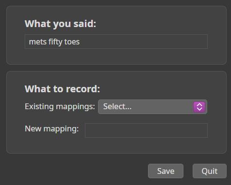

# Usage

## Search for a Music or Radio

### A Music

The rules to be spoken are defined in the `musicSearch` property; you can modify or add to them.

{width="200"}

|
English rule
| In the current language (e.g. French) | Explanation |
|:-----|:----- | :---|
| _music search_   | _Cherche de la musique_  | The default rule. The music is played in the room that issued the rule. |
| _music search in <a room\>_   | _Cherche de la musique dans le/la <une pièce\>_ | The music is played in the room specified in the rule. |

**For example:**  
- **music search** => _played in the current room_  
- **music search in the living room** => _played in the living room_

1. **music search**
2. The plugin asks you, "**What would you like to listen to?**"
3. Then, say the name of what you want to listen to.
4. If the title exists, the plugin repeats its name (see the [`musicTitleVoice`](voices.md#configure-a-voice) parameter) and plays it, and the command ends.
5. If the title does not exist, the plugin informs you with, "**I'm sorry, I couldn't find what you're asking for.**" and returns to step 2, "**What would you like to listen to?**"
6. Then, say another music name.

### A radio

The rules to be spoken are defined in the `radioSearch` property; you can modify or add to them.

{width="200"}

|
English rule
| In the current language (e.g. French) | Explanation |
|:-----|:----- | :---|
| _radio search_   | _Cherche une radio_  | The default rule. The radio is played in the room that issued the rule. |
| _radio search in <a room\>_   | _Cherche une radio dans le/la <une pièce\>_ | The radio is played in the room specified in the rule. |

**For example:**  
- **radio search** => _played in the current room_  
- **radio search in the living room** => _played in the living room_

1. **radio search**
2. The plugin asks you, "**What would you like to listen to?**"
3. Then, say the name of what you want to listen to.
4. If the radio exists, the plugin repeats its name and plays it, and the command ends.
5. If the radio does not exist, the plugin informs you with, "**I'm sorry, I couldn't find what you're asking for.**" and returns to step 2, "**What would you like to listen to?**"
6. Then, say another music name.

### Other Rules in the Search

If no music or radio is found, the command returns to "**What would you like to listen to?**"  
You can then say another title or radio station (see above) or say:

**Note:** The following rules are defined in the property [search.<language>](parameters.md)

#### `finish` rule

Use this rule to stop the command.

#### `As you wish` rule

Only for music, the plugin randomly searches for a title in the library and plays it.

**Note:** the command searches within the categories of the property [musicTypes.random](parameters.md)

#### `Add an association` rule

This rule displays a dialog box that allows you to add an association between what you said and what the plugin should understand.

**Note:** the fixed rules are defined in the property [search.<language>](parameters.md)

**For example:** Suppose I search for an artist `B52's` (in French), the plugin understands `mets fifty toes.`. 

1. After saying **Add an Association**, the window opens:

    {width="250"}

2. Then enter the new mapping in the "What to record" section.
    
    You can also choose an existing mapping from the `Existing mappings` list if `B52's` already exists.

    {width="250"}

3. Click on `save`
4. Search again for the artist `B52's`.

### All Other Commands

Below are listed all the other possible commands.

**Some explanations for reading the table:**  

- The **Rule by default** column shows one of the rules defined in the **Command** column when the plugin is installed. You can add or modify them as you wish in the **_rules.<command>_** property of the plugin.
- Check the **Multiroom** column to see if you can provide a room name in the rule. For example, for the `previousMusic` command you can say:  
    - **Previous music** ==> Plays the previous music in the current room
    - **Previous music in the living room** ==> Plays the previous music in the room specified in the rule

|
English rule
| 
In the current language (e.g. French)
 | 
Command
 | Multiroom | Explanation |
|:-----|:--- |:--- |:---:| :---|
| _previous music_ | _musique précédente_ |  `previousMusic` | {width="12"} | Plays the previous music |
| _next music_ | _musique suivante_ | `nextMusic` | {width="12"} | Plays the next music |
| start the music | _démarre la musique_ | `musicPlay` | {width="12"} | Starts playback |
| stop the music | _stop la musique_ | `musicStop` | {width="12"} | Stops playback |
| set the TV sound | _mets le son de la télé_ | `activateTvSound` | {width="12"} | Stops music playback (if necessary) and sets the TV sound ("Playbar" by default or the Player defined in the [`playerTV`](parameters.md#parameters) property) |
| set the volume to <_value_> | _mets le son à <_value_> | `setVolume` | {width="12"} | Sets the player's volume to the specified value |
| lower the volume | _baisse le son_ | `volumeDown` | {width="12"} | Lowers the player's volume by the value defined in the [`volumeUpDown`](parameters.md#parameters) property |
| increase the volume | _monte le son_ | `volumeUp` | {width="12"} | Increases the player's volume by the value defined in the [`volumeUpDown`](parameters.md#parameters) property |
| unmute | _remet le son_ | `muteOn` | {width="12"} | Reactivates the player's sound |
| mute | _coupe le son_ | `muteOff` | {width="12"} | Mutes the Player |

