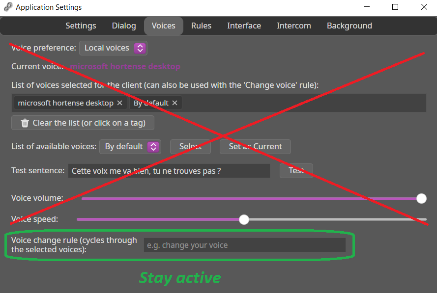
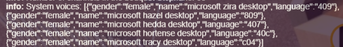
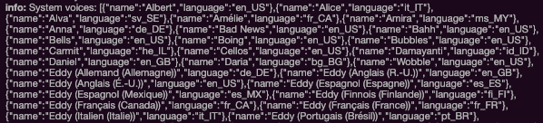
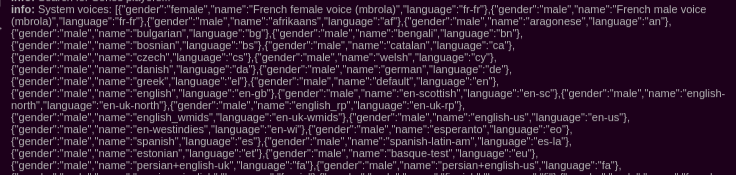
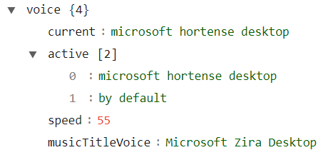
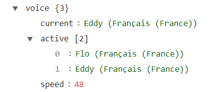
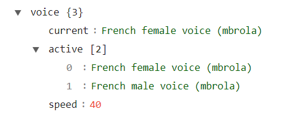
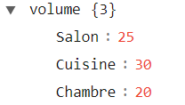

# Redirecting Dialogues

When you redirect a client's dialogues to the sonosPlayer plugin, the voice settings you defined in the `Voices` tab of that client's properties are no longer used.

The only configuration remaining active in this tab is the rule used to change voices. All other settings are configured in the sonosPlayer plugin properties.

{width="450"}

## Configure a Voice

### Set the Language Used

It is necessary to define the language code to set a default language when no voice is defined.  
The plugin will search for the first voice found in that language from the list of available system voices.

1. Start the A.V.A.T.A.R server (if it is not already running)
2. Open `Plugin Studio` and click on the `sonosPlayer` plugin
3. Click on the `Properties` tab
4. Set the `ttsLanguage` property with the code of the language used. 

    **Example:**  
    For French: fr-FR  
    For English: en-GB

5. Save the settings
6. Restart the server

**Note:** You can find the ISO language codes online, for example on [this site](https://docwiki.embarcadero.com/RADStudio/Athens/fr/Noms_Langue-Culture,_codes_et_valeurs_ISO)

### Retrieve Available Voices

The first step is to retrieve the voices available on your system:

1. Start the A.V.A.T.A.R server (if it is not already running)
2. Open `Plugin Studio` and click on the `sonosPlayer` plugin
3. Click on the `Properties` tab
4. Set the `showSystemVoices` property to `true`
5. Save the settings
6. Restart the server

Choose the tab corresponding to your platform to retrieve the available voices:

=== "Windows"

    Open the console and note the voice(s) you want to use (located in the `name` field).

    {width="500"}

    You can consult the file _app/core/plugins/sonosPlayer/lib/simpletts/batchs/win32/BCP47.loc_ to look up the country code for a language.
    
    **For example:**

    - For a French language (fr-FR), the country code is '40C' and in the screenshot, the voice is 'microsoft hortense desktop'
    - For an English language (en-GB), the country code is '809' and in the screenshot, the voice is 'microsoft hazel desktop'

=== "MacOS"

    Open the console and note the voice(s) you want to use (located in the `name` field).

    {width="600"}

    **For example:**

    - For a French language, the language is 'fr_FR' and in the screenshot, the voice is 'Eddy (Français (France))'
    - For an English language, the country code is 'en_GB' and in the screenshot, the voice is 'Daniel'

=== "linux"

    The Linux system is a special case. It doesn't have system language packs.
    Fortunately, we have an alternative voice system:

    - `espeak` is a multi-language speech synthesizer, which we'll use only for phonetic conversion.
    - `mbrola` is a multi-language voice synthesizer that offers improved rendering and can be coupled with espeak.

    If `espeak` and `mbrola` are not installed on the A.V.A.T.A.R server platform, follow steps 1 and 2 below.  
    If `espeak` and `mbrola` are installed on the A.V.A.T.A.R server platform, follow only step 2.
    
    1. Consult the A.V.A.T.A.R documentation in the chapter [Installing espeak and mbrola](https://avatar-home-automation.github.io/docs/linux-client-install/#installing-espeak-and-mbrola)
    2. Then add `mbrola` voices by following the [Installation](https://avatar-home-automation.github.io/docs/client-dialog-tab/#installation) chapter.  
        **Attention:** The documentation is designed for installing voices on client platforms.  
        In the **Configure mbrola voices** section, you must **absolutely** modify the configuration file _directory/resources/app/core/plugins/sonosPlayer/lib/simpletts/batch/linux/voices/voices.json_ of the `sonosPlayer` plugin by adding your `mbrola` voices, not the one defined in the documentation (e.g. _directory/resources/app/core/lib/tts/linux/voices/voices.json_)

    Then open the A.V.A.T.A.R console and note the voice(s) you want to use (located in the `name` field).

    {width="650"}

    The voices are specific to `espeak` and `mbrola`. Both appear in the list, with `mbrola` voices (if installed) appearing first.

    **For example:**

    - For a French language, the language is 'fr-FR' and in the screenshot, the voice is 'French female voice (mbrola)'
    - For an English language, the country code is 'en-GB' and in the screenshot, the voice is 'english'

You can then set the `showSystemVoices` property back to `false`.

???+ warning "Important"
    
    Try to solve the problem by reading the [Possible errors and resolutions](https://avatar-home-automation.github.io/docs/client-dialog-tab/#possible-errors-and-resolutions) chapter of the A.V.A.T.A.R documentation.

    In some cases, even with the language pack installed, no voice may be available.  

    Once you've checked that everything's in order, and if the problem persists, it's not a bug in the application but a problem with the system's language pack. 
        
### Configure the Voices

After retrieving the available voices, the next step is to add them to the plugin's settings.

1. In the `platform` section, choose the platform corresponding to your installation:

    **Windows:** _platform/win32_  
    **macOS:** _platform/darwin_  
    **linux:** _platform/linux_
    
2. Choose the tab corresponding to your platform to configure the voices in the `voice` section:

    === "Windows"
        |
Parameter
| Type | 
Value
 | Mandatory | Comment |
        |:-----|:---:|:---|:---:| :---|
        |`current`| string | The name of the voice | no | The voice used for dialogues.  **Empty or 'by default':** The first voice found among the system voices matching the `TTSLanguage` property. |
        |`active`| array | An array of possible voices | no | The voices used for changing voices when you use the `Change Voice` rule.  **[] or ["by default"]:** The first voice found among the system voices matching the `TTSLanguage` property. |
        |`musicTitleVoice`| string | The name of the voice | no | When you select a music track or a radio station, you have the option for A.V.A.T.A.R to repeat the title using a different voice. For example, if you want the title to be pronounced with an English voice (with an English accent), choose an English voice name.  **Empty:** The current voice is used. |
        |`speed`| integer | 52 > `speed` < 58: good speed 0 > speed < 100| yes | The speed of the voice used for dialogues (`current`). |

    === "MacOS"
        |
Parameter
| Type | 
Value
 | Mandatory | Comment |
        |:-----|:---:|:---|:---:| :---|
        |`current`| string | The name of the voice | no | The voice used for dialogues.  **Empty or 'by default':** The first voice found among the system voices matching the `TTSLanguage` property. |
        |`active`| array | An array of possible voices | no | The voices used for changing voices when you use the `Change Voice` rule.  **[] or ["by default"]:** The first voice found among the system voices matching the `TTSLanguage` property. |
        |`musicTitleVoice`| string | The name of the voice | no | When you select a music track or a radio station, you have the option for A.V.A.T.A.R to repeat the title using a different voice. For example, if you want the title to be pronounced with an English voice (with an English accent), choose an English voice name.  **Empty:** The current voice is used. |
        |`speed`| integer | 45 > `speed` < 50: good speed 0 > speed < 100| yes | The speed of the voice used for dialogues (`current`). |

    === "linux"
        |
Parameter
| Type | 
Value
 | Mandatory | Comment |
        |:-----|:---:|:---|:---:| :---|
        |`current`| string | The name of the voice | no | The voice used for dialogues.  **Empty or 'by default':** The first voice found among the system voices matching the `TTSLanguage` property. |
        |`active`| array | An array of possible voices | no | The voices used for changing voices when you use the `Change Voice` rule.  **[] or ["by default"]:** The first voice found among the system voices matching the `TTSLanguage` property. |
        |`musicTitleVoice`| string | The name of the voice | no | When you select a music track or a radio station, you have the option for A.V.A.T.A.R to repeat the title using a different voice. For example, if you want the title to be pronounced with an English voice (with an English accent), choose an English voice name.  **Empty:** The current voice is used. |
        |`speed`| integer | 45 > `speed` < 50: good speed 0 > speed < 100| yes | The speed of the voice used for dialogues (`current`). |

#### Examples

Examples of settings by platform

=== "Windows"

    {width="350"}

=== "MacOS"

    {width="350"}

=== "linux"

    {width="350"}

### Other Parameters

#### `addDuration`

The length of the text to be played on the Sonos Player is normally that retrieved from the audio file. However, depending on the platform, network performance, or the speed at which Sonos processes the file, it may happen that the file's duration is not synchronized with the time Sonos takes to play it, causing it to be truncated during playback.

If you notice that messages are regularly truncated, enter a value in seconds for this parameter in the section corresponding to your platform to extend the processing duration.

#### Common Parameters

The _platform/common_ section groups all parameters common to all platforms

|
Parameter
| Type | 
Value
 | Mandatory | Comment |
|:-----|:---:|:---|:---:| :---|
|`defaultVolume`| integer | 0 > `defaultVolume` < 100 | yes | The default volume set before playback if the room is not defined in the `volume` parameter. The Player's volume is then restored to its previous position. |
|`defaultDuration`| integer | In seconds | yes | The duration of the audio file if it could not be retrieved. |
|`volume`| object | room : volume | no | The volume set before playback in the Sonos room. **Example:** {width="150"}. The Player's volume is then restored to its previous position. |

